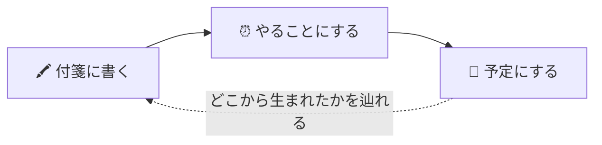

# みんなのボード

ホワイトボード・カレンダー・リマインドを、URL を共有するだけでみんなで使える Web サイトです。
話したことが、そのまま予定とやることになります。

- **ログイン不要** — 最初に表示名を入力するだけで使い始められます
- **みんなで同時に** — 書いたものは、開いている人の画面にその場で届きます
- **付箋から予定まで一続き** — 付箋を「やること」にも「予定」にもでき、どこから生まれたかを辿れます



## 目次

- [はじめる](#はじめる)
- [できること](#できること)
- [知っておいてほしいこと](#知っておいてほしいこと)
- [技術構成](#技術構成)
- [テスト](#テスト)
- [スクリプト](#スクリプト)
- [ドキュメント](#ドキュメント)

## はじめる

### 使う

1. 表示名を入力する
2. 「新しいボードを作る」→ 公開 / 非公開 と、最初のレイアウトを選ぶ
3. 表示された共有リンクを、一緒に使いたい人に送る

非公開ボードのリンクを開いた人には、申請フォームが出ます。作成者のヘッダーに 🔴 バッジが付くので、👥 から「編集できる」か「閲覧のみ」を選んで承認します。承認すると、相手の画面はリロードなしでボードに切り替わります。

### 開発する

Node.js 22 以上が要ります。

```bash
npm install
cp .env.example .env.local   # Supabase の URL と anon key を記入
npm run dev                  # http://localhost:5173
```

Supabase プロジェクトの作成から Vercel へのデプロイまでは、**[docs/SETUP.md](docs/SETUP.md)** に手順をまとめています。

## できること

ボードの中は 5 つのタブに分かれています。ボードの外には、参加しているボードを跨いで自分の担当を集める 🏠 ホームがあります。

| タブ | 何をするところか |
| --- | --- |
| 🖍️ ホワイトボード | 付箋・手描き・画像を並べて話す |
| 📅 カレンダー | 予定・繰り返し・出欠 |
| ⏰ リマインド | 担当と期限のあるやること |
| 📣 更新 | ボードで起きたことの時系列と、ゴミ箱 |
| 📊 ダッシュボード | やることの数・担当ごとの残り・今週の予定と締切をひと目で |

ヘッダーには 🔍 検索 / 💬 チャット / 🔔 通知 / 👥 参加者 / 🔗 共有 があります。

### 🖍️ ホワイトボード

- **付箋** — 貼る / 動かす / サイズ変更 / 6 色 / ダブルクリックで編集
- **テキストボックス** — 枠なしで見出しだけ置ける
- **手描き・図形** — ペン（6 色・4 段階）/ 消しゴム / 直線・矢印・四角・円
- **画像** — Ctrl+V、ドラッグ＆ドロップ、ファイル選択に対応
- **複数選択と整列** — 範囲ドラッグで囲んで、左揃え・横に並べる・グリッドに吸着
- **投票** — 付箋に 👍 を入れて優先順位を決める（ドット投票）
- **絵文字リアクション** — 付箋に絵文字で反応
- **コメント** — 付箋・画像・ファイル・フレームに付けられます（閲覧のみの人も書けます）
- **やること / 予定にする** — 付箋を選んで ⏰ / 📅。担当と期限をその場で決められます
- **テンプレート** — KPT / カンバン / ブレスト / 会議メモ
- **Undo / Redo** — Ctrl+Z / Ctrl+Shift+Z で、自分の操作を取り消せます
- **カーソル共有** — 誰がどこを見ているかが名前つきで見えます
- **一覧表示** — スマホでは付箋を 1 列に並べて、タップで編集・並べ替え
- **PNG 書き出し** — ボードを画像 1 枚にして保存。付箋・手描き・画像に加えて、フレーム・線・ファイルのカードも画面と同じ重なり順で写ります

### 📅 カレンダー

- **4 つの表示** — 月 / 週 / 日 / リスト。週・日表示は時間軸つき
- **ドラッグで移動** — 月表示で別の日へ。週表示で時間帯を変更、端をつまんで延長
- **終了時刻・複数日にまたがる予定** — 「8/1〜8/3 の旅行」など
- **繰り返し予定** — 毎日 / 毎週 / 毎月 / 毎年。終了日も指定できます
  - 毎週は**曜日を複数**選べます（「毎週 火・木の練習」）
  - 毎月は**「第 2 火曜」のような曜日指定**ができます
  - **「n 回ごと」**も選べます（隔週の練習、3 か月ごとの点検）
- **「この回だけ」変更・削除** — 定例を今週だけ午後にずらす、祝日の回だけ休む。ドラッグで動かした場合もその回だけに効きます（変更した回には ✏️ が付きます）
- **出欠** — 予定の回ごとに ○ / △ / × を集められます。繰り返しなら回ごとに別々に答えられ、「閲覧のみ」の参加者も答えられます（行く・行かないはボードの編集ではないため）
- **日本の祝日** — 振替休日・国民の休日・春分秋分まで計算（外部通信なし）
- **事前通知** — 15 分前・1 時間前・1 日前など
- **リマインドの重ね表示**、予定から「準備すること」を作成、予定ごとのコメント
- **出自** — 付箋から作った予定には「この付箋から生まれました」が出ます

#### カレンダーの外とのやり取り

- **.ics 書き出し** — Google カレンダーや iPhone に取り込めます
- **カレンダーの購読 URL** — ボードの予定を読み取り専用の .ics として配れます。Google カレンダーや Apple カレンダーに貼ると、あとから足した予定も追いかけます
  > 作り直すか止めるまで有効な「読み取りの権限」なので、渡す相手は選んでください。
- **外部カレンダーの購読** — 公開されている .ics の URL を登録すると、カレンダーに重ねて表示します

<details>
<summary>.ics 書き出しで保たれるもの</summary>

- 「この回だけ変更・削除」は `RECURRENCE-ID` / `EXDATE` として保たれます
- 曜日指定は `BYDAY`（`TU,TH` / `2TU`）、「n 回ごと」は `INTERVAL` として書き出されます
- **毎月 31 日・毎年 2/29 の予定も、取り込み先で同じ回数になります。**
  このアプリは「その月に無い日は月末に丸める」（1/31 の毎月 → 2/28）方式ですが、.ics の `FREQ=MONTHLY` は仕様上「無い日はその月を飛ばす」と解釈されます。丸める・飛ばすのどちらが正しいかは決めの問題なので、アプリ側の挙動は変えず、丸めで生まれる回だけを `RDATE` として書き添えています。終了日を決めていない繰り返しでは、書き添えるのは 3 年ぶんです。

</details>

<details>
<summary>外部カレンダーで読める繰り返しとタイムゾーン</summary>

- 海外のカレンダー（`TZID` つき）も、相手のタイムゾーンで書かれた時刻のまま正しく出ます
- 夏時間の切り替えも追うので、向こうの 10:00 の定例は切り替えを跨いでも 10:00 のままです
- 名前が引けないタイムゾーンでも、`VTIMEZONE` に書かれた切り替えの規則から読みます
- 次の繰り返しも、正しい日に出ます
  - 「毎月第 2 火曜」のような `BYDAY`
  - 「毎月 1 日と 15 日」「毎月の月末」の `BYMONTHDAY`
  - 「12 月 25 日」の `BYMONTH`

</details>

### ⏰ リマインド

- **期限つき TODO** — **期限切れ / 今日 / 3 日以内 / それ以降 / 期限なし / 完了** に自動分類
- **担当者** — 参加者から選択。「自分の担当」だけに絞り込めます
- **事前通知**、**繰り返しタスク**（完了すると次回分を自動生成）
- **サブタスク** — チェックリストで進捗を「3/5」と表示
- **コメント** — タスクごとに付けられます
- **予定にする** — やることをそのままカレンダーへ

### 🏠 ホーム（自分の番）

ボードが 2〜3 個のうちは開いて確かめられますが、増えると「どれを開けばいいか」から分からなくなります。その手前を埋めるための画面です。

- 参加しているボードを**跨いで**、自分の担当と 7 日先までの予定を 1 か所に集めます
- **期限切れ / 今日のやること / 今日の予定 / 今週** の 4 つに分けます。重ならないので、足すと件数に合います
- どのボードのことかを併記し、押すとそのボードの該当タブを開いて、その行まで飛びます

### 📣 更新

- 付箋・予定・やること・コメント・日程調整・参加者の動きを **1 本の時系列**で表示
- 種類ごとの絞り込みと、未読バッジ
- **変更履歴** — 誰が何を変えたかをサーバー側で記録しています
- **アクセスの履歴** — 参加の承認・権限の変更・アクセスの取り消し・合言葉の設定・リンクの作り直しも残ります。ログイン不要だからこそ、「いつ誰が入ってきたか」を後から確かめられるようにしています
- ここから **ゴミ箱**（30 日ぶん）を開いて、消したものを戻せます

### 👥 共有・権限

**入り方**

- **公開ボード** — URL を知っていれば誰でもすぐ参加
- **非公開ボード** — 参加は申請制。作成者が承認した人だけ
- **合言葉** — 合言葉を知っている人は、承認を待たずに参加できます
- **QR コード** — その場にいる人はカメラで読み取って参加
- **配ったあとで締める** — 新しく参加できる期限 / 人数上限 / 受付停止 / リンクの作り直し
  > 期限は「新しく参加できる期限」です。リンクそのものが使えなくなるわけではありません。

**権限とボードの管理**

- **閲覧のみ / 編集できる** — 参加者ごとに設定。閲覧のみでもコメントと投票はできます
- **在席表示** — いま誰が見ているかをヘッダーに表示
- **ボードを終了する** — 中身は読めるまま、新しい書き込みだけを止めます。イベントが終わったあとの記録置き場に。あとから再開できます
- **ボード管理** — 名前変更・公開設定・複製・終了 / 再開・削除・退出

### 🔍 検索・💬 チャット・🔔 通知

- **横断検索** — 付箋・予定・TODO・コメント・タグをまとめて検索してジャンプ
- **チャット** — ボードごとの会話（未読バッジつき）
- **通知** — @メンション / 担当の指名 / 参加申請と承認 / 付箋が行動になったとき
- **プッシュ通知**（任意設定）— タブを閉じていても通知が届きます

### 🗑️ ゴミ箱と保存した状態

- **ゴミ箱** — 消した付箋・予定・やること・画像・フレーム・線・ファイル・手描き・コメントは、30 日戻せます（他の人が消したものも）。消しゴムのひと撫では「手描き 18 本」のように 1 行にまとまります
- **保存した状態** — 「この時点」を控えて、あとから丸ごと戻せます

<details>
<summary>手描きとコメントだけ、ゴミ箱の扱いが少し違います</summary>

**手描き** — 1 ボードの上限 2500 本は「いま見えている線 ＋ ゴミ箱の線」の合計です。描き足して天井に届くと、ゴミ箱のいちばん古い線から先に消えます（30 日の保証ではなく、余裕があるあいだの猶予）。手描きは 1 本が重く、30 日ぶんを上限の外に置くと最悪ケースが倍になるためです。描く手が止まるより、古い線が先に消えるほうを選んでいます。

**コメント** — 消せるのは書いた本人と、ボードを作った人だけです（他の種類は編集できる人なら誰でも）。事故ではなくモデレーションの操作なので、**戻せるのも消した本人か作った人だけ**にしています。ゴミ箱に出るのも自分が消したぶんだけです（作った人には全部見えます）。

</details>

### 📶 オフラインとつながり

- **オフラインでも書ける** — つながっていないあいだの付箋・予定・やること・コメントは手元にためて、つながったら送ります（ヘッダーの未送信バッジから中身を見られます）
- **つながり具合の表示** — 保存済み / 同期中 / オフラインに加えて、つながってはいるが更新が即座には届かない状態（再接続中）もヘッダーに出ます。「今すぐ確認」で取り直せます。送信待ちのものがあるときは、代わりに「↑ n件未送信」が出ます
- **落ちても行き止まりにしない** — 画面の描画が失敗したときは、白い画面ではなく受け皿を出します。まだ送っていない書き込みがあれば、その場でテキストに落とせます

### そのほか

- **タグ** — 付箋・予定・リマインドに付けて絞り込み
- **CSV の書き出し・取り込み** — 予定とやることを表計算ソフトとやり取りできます
- **端末の引き継ぎ**（任意）— メールアドレスを結びつけると、別の端末でも同じ自分になります
- **ダークモード** — ライト / ダーク / OS に合わせる
- **スマホ対応** — 小さい画面では付箋を一覧表示。ツールバーは横スクロール
- **キーボードだけでも閉じられる** — モーダルはダイアログとして支援技術に伝わり、Tab は中で回ります。閉じるとフォーカスは開く前の場所へ戻ります

## 知っておいてほしいこと

### 利用者と名前

- 利用者は**ブラウザ単位**で識別されます。別ブラウザからは別人扱いになるため、オーナー権限の引き継ぎ用に「オーナー復帰リンク」を用意しています（共有モーダル内）
- 表示名は自己申告です。厳密な本人確認が必要な用途には向きません
- 付箋・コメント・予定などに出る**作成者名は、サーバー側で本人の表示名に揃えられます**。他人の名前を名乗って書き込むことはできません（表示名そのものは自己申告のままです）

### 共有とボードの終了

- 合言葉・参加期限・人数上限・受付停止を設定すると、ボードは**自動的に非公開**になります。公開のままでは URL を知っている人が中身を読めてしまい、条件が効かないためです
- **終了したボードでは、作成者を含めて誰も書き込めません**（サーバー側の判定なので、画面を直接叩いても書けません）。読むこと・書き出すこと・複製することはできます
- ボードの終了・名前の変更・共有リンクの作り直し・削除は、開いている人の画面にもその場で反映されます。合図が届かなかったときも 60 秒以内には追いつきます（ホーム画面から終了したときは、この 60 秒の側だけが働きます）

### カレンダー

- 繰り返し予定は「この回だけ」と「すべての回」を選んで編集・削除できます。ただし、すべての回の**開始日や繰り返し方**を変えると、回の並びがずれるため、「この回だけ」の変更**と出欠**は取り消されます（保存前に確認が出ます）
  - 曜日を**足しただけ**なら、それまでの回はそのままなので取り消されません
  - 取り消しはサーバー側で行います（画面からは他人の出欠を消せないため）
- 祝日は 1980〜2099 年の範囲で計算しています（春分・秋分は近似式）

### 取り消しと復元

- Undo / Redo は「自分がこのタブで行った操作」だけが対象です。他の人が消したものは、ゴミ箱（📣 更新タブ、またはボードの設定）から戻せます
- 保存した状態から**戻せるのはボードを作った人だけ**です（控えるのは編集できる人なら誰でも）。戻すと、そのとき作った人の記録は「戻した人」に付け替わります（画面に出る作成者名は控えたときのまま残ります）
- 戻したときに置き換わるものは**ゴミ箱に 30 日残ります**。もともとゴミ箱にあったものもそのままです。ただし 30 日より古い控えから戻すと、ファイルの実体はすでに掃除されていることがあります（行は戻っても開けません）

### オフライン

オフラインのあいだに書いたものは、この端末にためて、つながったら送ります。

- ためるのは付箋・予定・やること・コメントの**文字**だけです。手描き・画像・ファイル・投票はためません（画像とファイルは、置こうとした時点で断ります）
- ためた分はヘッダーに「↑ n件未送信」と出て、押すと中身を見られます
- 同じものを何度直しても、送るのは 1 回ぶんです。作ってすぐ取り消したものは 1 件も送りません
- 送れなかったもの（権限を外された・上限に達した・他の人が先に書き換えた）は送信箱に残り、文字をコピーして取り出せます。終了したボードでも取り出せます
- **ためた場所はこの端末の中だけ**です。別の端末や別のブラウザには引き継がれません

仕組みまで含めた説明は [docs/SETUP.md の「仕組みと制約」](docs/SETUP.md#仕組みと制約) にあります。

## 技術構成

| 役割 | 使っているもの |
| --- | --- |
| フロントエンド | Vite + React 18 + TypeScript + Tailwind CSS v4（静的サイト） |
| バックエンド | Supabase（PostgreSQL / Realtime / Storage / 匿名サインイン / RLS） |
| プッシュ通知 | Service Worker + Supabase Edge Function（任意） |
| ホスティング | Vercel |

- **常駐サーバーはありません。** アクセス制御はすべて PostgreSQL の RLS（行レベルセキュリティ）で行っていて、定義は [`supabase/schema.sql`](supabase/schema.sql) の 1 ファイルにまとまっています
- **画面は開いたときに取りに行きます。** ページ（ホーム / ボード）・タブ・モーダルの単位に分けていて（`React.lazy`）、ホワイトボードやカレンダーはそのタブを開くまで読み込みません

  | | 最初に読み込む JavaScript | gzip |
  | --- | --- | --- |
  | 分ける前 | 794 KB | 241 KB |
  | いま | 約 410 KB | 約 124 KB |

### ディレクトリ構成

<details>
<summary>ファイルの置き場所を見る</summary>

```
supabase/
├─ schema.sql                 テーブル・RLS・トリガー・RPC・ストレージ
├─ cron.sql                   定期実行（プッシュ通知・掃除。任意）
├─ config.toml                Edge Function ごとの JWT 検証の設定
├─ release-smoke.sql          本番へ流したあとの確認（pgTAP 不要・巻き戻す）
├─ functions/
│   ├─ send-reminders/        通知を送る（cron から。任意）
│   ├─ purge-storage/         消したファイルの実体を掃除する（cron から）
│   ├─ fetch-ics/             外部カレンダーの取得中継（SSRF 対策つき）
│   ├─ board-ics/             ボードの予定を購読 URL（.ics）として配る
│   ├─ _shared/               フロントと共有する日付・繰り返し・入口の認証
│   ├─ tests/                 Edge Function のテスト（Deno。Supabase は要らない）
│   └─ deno.json              この下だけ Deno の世界。npm の側とは切り離す
├─ tests/
│   └─ rls.test.sql           権限が効いているかのテスト（pgTAP）
└─ stubs/
    └─ _stub_storage.sql      使い捨ての DB で schema.sql を流すための足場

e2e/                          ブラウザで実際に触るテスト（Playwright）
.github/workflows/ci.yml      push したときにテストを全部回す
public/sw.js                  プッシュ通知の Service Worker

src/
├─ lib/
│   ├─ supabase.ts            クライアント + 匿名サインイン
│   ├─ identity.tsx           表示名の管理
│   ├─ theme.tsx              ライト / ダーク / OS 追従
│   ├─ roomData.tsx           ルームの全データを 1 か所で購読
│   ├─ access.ts              入り方（リンク公開 / 合言葉つき / 承認制）の判定
│   ├─ attendance.ts          予定の出欠と、回の並びが動いたかの判定
│   ├─ trash.ts               ゴミ箱の残り日数と、戻せるかの判定
│   ├─ overview.ts            ホームの「自分の番」（ボードを跨いだ区切りと数え方）
│   ├─ snapshot.ts            控えの大きさと、宙ぶらりんになったものの判定
│   ├─ writeQueue.ts          オフラインの送信箱（畳み方と、失敗の見分け）
│   ├─ writeQueueDb.ts        送信箱の置き場（IndexedDB・タブ間の知らせ）
│   ├─ outboxStore.ts         送信箱の中身を持つストア
│   ├─ outboxText.ts          送信箱の中身を、持ち出せる文字にする
│   ├─ roomChannel.ts         ボード設定の変更を、開いている人に知らせる合図
│   ├─ errorMessage.ts        例外を、人に見せる 1 行にする
│   ├─ recurrence.ts          繰り返し予定の展開
│   ├─ tz.ts                  外部カレンダーのタイムゾーン換算
│   ├─ icsRecurrence.ts       外部カレンダーの繰り返し（相手の暦で数える）
│   ├─ convert.ts             付箋 → やること → 予定 の組み立て
│   ├─ names.ts               同じ表示名の人を見分ける
│   ├─ holidays.ts            日本の祝日の計算
│   ├─ ics.ts                 .ics 書き出しとダウンロード
│   ├─ boardExport.ts         ボードを PNG に描き直す
│   ├─ attachmentCard.ts      ファイルのカードの絵文字と大きさの言い方
│   ├─ focusTrap.ts           モーダルの中でフォーカスを回す
│   ├─ templates.ts           KPT・カンバンなどの雛形
│   └─ types.ts
├─ hooks/
│   ├─ useRealtimeTable       テーブル購読 + 楽観的更新
│   ├─ useRoomAccess          権限判定（オーナー / 編集 / 閲覧のみ / 承認待ち）
│   ├─ usePresence            在席とカーソルの共有
│   ├─ useReminders           予定と TODO の事前通知
│   ├─ usePushNotifications   プッシュ通知の購読管理
│   ├─ useUndoStack           Undo / Redo
│   ├─ useBoardUpdates        更新タブ用に「起きたこと」をまとめる
│   ├─ useNotifications       自分あての通知と @メンション
│   ├─ useSignedUrls          非公開バケットの画像表示
│   └─ useWriteQueue          ためた書き込みを、つながったら送る
├─ components/                名前入力・参加申請・参加者・共有（QR・合言葉）・検索・設定・
│                             チャット・通知・変換・ゴミ箱・保存した状態・端末の引き継ぎ・
│                             モーダルの土台（Modal）・描画が落ちたときの受け皿（ErrorBoundary）
├─ test/                      jsdom の下ごしらえ（ポインタ捕捉など、jsdom に無いもの）
└─ pages/
    ├─ HomePage               自分の番 / ボード作成 / 参加中のボード一覧
    ├─ RoomPage               権限ゲート + タブ + 各種パネル
    └─ tabs/                  ホワイトボード（付箋・一覧・描画・画像・カーソル）/
                              カレンダー / リマインド / 更新 / ダッシュボード
```

</details>

> [!NOTE]
> 各 Edge Function は `index.ts`（`Deno.serve(handler)` の 1 行）と `handler.ts`（中身）に分かれています。読むときも直すときも `handler.ts` を見てください。
> `Deno.serve` をモジュールの一番上で呼んでいると、テストが import した時点でポートを掴んでしまうためです。

### データの持ち方

| テーブル | 内容 |
| --- | --- |
| `rooms` / `room_secrets` / `room_members` | ボード、オーナー復帰トークンと合言葉、参加者・申請・編集権限 |
| `notes` / `strokes` / `images` / `attachments` | 付箋とテキスト、手描き・図形、画像とファイルの配置 |
| `connectors` / `frames` | 付箋をつなぐ線、領域を囲むフレーム |
| `note_votes` / `note_reactions` | 付箋へのドット投票と絵文字リアクション |
| `events` / `event_overrides` / `todos` | 予定、繰り返しの「この回だけ」、リマインド |
| `polls` / `poll_options` / `poll_votes` | 日程調整 |
| `event_attendance` | 予定の回ごとの出欠（○/△/×） |
| `calendar_feeds` | 外部カレンダー（.ics）の購読設定 |
| `comments` / `activities` / `notifications` | チャットとコメント、変更履歴、自分あての通知 |
| `snapshots` | 保存した状態（付箋・線・予定・やること・ファイル・👍・日程調整・出欠を丸ごと） |
| `push_subscriptions` / `reminder_sends` | プッシュ通知の送信先と送信済み記録 |
| `access_attempts` | 合言葉・復帰トークンの失敗回数（総当たり対策。RPC の内側だけが触る） |
| `purge_queue` | 消した画像・添付の実体を掃除する予約（Edge Function が処理する） |
| `client_errors` | ブラウザ側で起きたエラー（書けるだけで、読むポリシーは無い） |

- **消してもすぐには無くなりません。** 付箋・予定・やること・画像・フレーム・線・ファイル・手描き・コメントには `deleted_at` があり、30 日ぶんはゴミ箱から戻せます
- **どこから生まれたかを覚えています。** やることと予定は `source_note_id` / `source_event_id` を持ちます
- **`strokes` だけ、件数の上限がゴミ箱の行も数えます。** 天井に当たったら古い行から物理削除して席を譲るので（`tg_limit_rows_per_room` の `'yield'`）、描き足しは止まりません。ゴミ箱の行まで上限の外に置くと、`points` の最悪ケースが倍になるためです
- **`comments` だけ `deleted_by` を持ちます。** 消す操作がモデレーションなので、戻せるのを「消した本人かボードを作った人」に絞るためです。書き込むのはサーバー側（`tg_comment_trash_guard`）で、画面から名乗ることはできません
- **画像の実体**は Storage の非公開バケット `board-images` に `<room_id>/<uuid>.<拡張子>` で置き、表示時に署名付き URL を発行します

## テスト

テストは 5 つの層に分かれていて、**合計 1,199 件**です（657 + 82 + 67 + 40 + 353）。層ごとに走らせ方も速さも違うので、表では層ごとの数を並べています。

| 層 | 道具 | 件数 | 走らせ方 |
| --- | --- | --- | --- |
| 純粋関数 | Vitest（node） | 657 件（29 本） | `npm test` |
| コンポーネント | Vitest（jsdom） | 82 件（12 本） | `npm test` |
| Edge Function | Deno | 67 件 | `npm run test:functions` |
| ブラウザ | Playwright | 40 件（Chromium 36、Firefox と WebKit は `@smoke` の 2 件ずつ） | `npm run test:e2e` |
| 権限（RLS） | pgTAP | 353 件 | `npm run test:db` |

それぞれが見ているもの:

- **純粋関数** — 繰り返し・祝日・ics・CSV・検索・オフラインの送信箱など
- **コンポーネント** — ドラッグの確定、取り消し・やり直しを押した順に流すか、モーダルのフォーカス、飛び先の合わせ方、通知の「まとめ」の読み取り、描画が落ちたときの受け皿など、DOM が要るもの
- **Edge Function** — 外部 .ics の中継が内側を向いた宛先へ行かないか、購読 URL の断り方が 1 つに揃っているか、cron の合言葉、通知の二重送信、消してはいけない実体を消さないか
- **ブラウザ** — 保存されて残るか、2 人目に届くか、入り方と権限、設定の反映、タブの切り替え、繰り返し予定・出欠・ゴミ箱・検索・オフライン・コメント・PNG 書き出し
- **権限（RLS）** — サーバー側の権限が効いているか（[下で詳しく](#権限rlsのテスト)）

ブラウザと権限のテストは、ローカルの Supabase が要ります（`npm run db:start`）。ブラウザのテストは Supabase が動いていなければ自動で飛ばすので、`npm test` の邪魔にはなりません。

### CI

push すると、[`.github/workflows/ci.yml`](.github/workflows/ci.yml) が 5 つの層をそのまま回します。

| ジョブ | 中身 |
| --- | --- |
| checks | lint・型・単体テスト・Edge Function（Deno は Supabase を立てずに走るので、ここに入れています） |
| backend | `supabase start` を立て、`schema.sql` を 2 回流して（冪等の確認）から pgTAP → Playwright |

CI では「Supabase につながらないから飛ばす」をしません。飛ばして緑になると、通ったのか何も走らなかったのか分からないからです。

### 権限（RLS）のテスト

[`supabase/tests/rls.test.sql`](supabase/tests/rls.test.sql) に、**サーバー側の権限が効いているか**を確かめるテストが 353 件あります。次のようなことを、許可・拒否の両方向から見ています。

- 終了したボードへの書き込み、閲覧のみの人の編集
- 変更履歴の偽造、書いた人の名前の上書き
- 全員締め出し、アクセスの取り消しと申し込み直し
- 参加期限、リンクの作り直し
- 他人のボードの行を指す「この回だけ」や投票
- Storage のパスとポリシー
- 保存した状態からの復元

最後の節は**棚卸し**です。RLS ポリシー・トリガー・ログイン済みの人が呼べる関数の一覧をそのまま控えてあり、増えても減っても落ちます。トリガーは「どの操作を見ているか」まで控えているので、**門番が片方の操作にしか居ない**状態がひと目で分かります（実際、`rooms_limit_per_user` が INSERT だけを見ていたせいで、オーナー復帰でボードの上限をすり抜けられました）。

> [!IMPORTANT]
> 棚卸しの節が落ちたときは、まず「その増減は意図したものか」を確かめてから控えを直してください。順番を逆にすると、この節は何も守らなくなります。

```bash
npm run test:db
# または
psql -U postgres -f supabase/tests/rls.test.sql
```

手順と、使い捨ての DB で試す方法は [docs/SETUP.md の「権限（RLS）が効いているか — 自動テスト」](docs/SETUP.md#権限rlsが効いているか--自動テスト) にあります。

## スクリプト

| コマンド | 内容 |
| --- | --- |
| `npm run dev` | 開発サーバー（<http://localhost:5173>） |
| `npm run build` | 型チェック + 本番ビルド（`dist/`） |
| `npm run preview` | 本番ビルドをローカルで確認 |
| `npm run lint` | ESLint。型を要求しないルールだけなので数秒で終わる |
| `npm test` | 純粋関数（node）とコンポーネント（jsdom）のテスト |
| `npm run test:watch` | 同上を変更のたびに実行 |
| `npm run test:e2e` | ブラウザで実際に触るテスト（`npm run db:start` が要る） |
| `npm run test:functions` | Edge Function のテスト（Deno。Supabase は要らない） |
| `npm run check:functions` | Edge Function の型（`tsc` は `supabase/` を見ていない） |
| `npm run test:db` | 権限のテスト（pgTAP。`npm run db:start` が要る） |
| `npm run db:start` / `npm run db:stop` | ローカルの Supabase を立てる / 止める |

開発サーバーは既定で `localhost` だけに開きます。同一 LAN の別端末から確認したいときは、`.env.local` に `VITE_LAN=1` を足してください。

## ドキュメント

| ファイル | 内容 |
| --- | --- |
| [docs/SETUP.md](docs/SETUP.md) | Supabase の作成から Vercel への公開まで。任意機能の設定、動作確認、仕組みと制約 |
| [docs/GUIDE.html](docs/GUIDE.html) | 紹介ページ |
| [docs/MANUAL.html](docs/MANUAL.html) | 操作手順書。画面ごとに、やりたいことから手順を引けます |
| [docs/OVERVIEW.html](docs/OVERVIEW.html) | 技術資料。成り立ち、使っている言語と道具、画面ごとの操作方法 |

HTML の 3 つは、ダウンロードしてブラウザで開くと読めます（GitHub 上ではソースが表示されます）。
